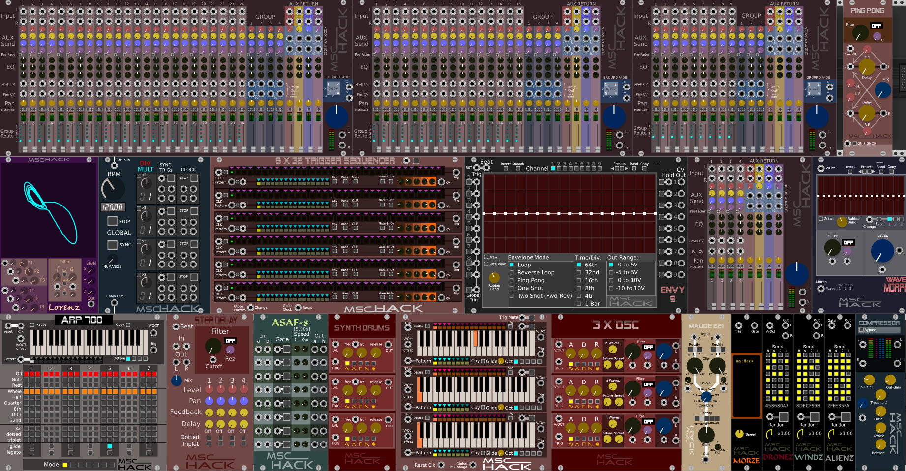

# mscHack Plugins for VCV Rack 0.6.0

# Updates
- 26 Mar 18:
	- Updated to VCV Rack 0.6.0
	- Added "Maude 221" module for wave combining
	- Added Step Delay (still in development)
	- fixed clock sync in MasterClock, and sequencers.
	- decreased size of MasterClock
	- old 4x4 mixer and original Triad sequencer removed

# Includes
- 4 Channel Master Clock
- 3 Channel 16 Step Programmable Sequencer.
- 6 Channel 32 Step Sequencer
- Mixer 1x4, 2x4 and 4x4 (with EQ, 4xAUX buses, and 2 x amplification )
- Triad Sequencer (Type 2), with Independantly clocked channels
- Synth Drums
- 3 Channel Oscillator with Filter and Amp Envelope (latest has multi oscillator capability)
- Ping Pong Delay
- Compressor (a work in progress...)
- X Fade, 3 stereo channel cross fader
- ARP 700, 7 note arpeggiator.
- Maude 221 wave combiner
- Step Delay

# Demo Vids
- 4 Channel Master Clock https://www.youtube.com/watch?v=hiQciS8ch5U
- Sequencer: https://www.youtube.com/watch?v=2PN0-UZhocA
- Mixer: https://www.youtube.com/watch?v=QOjSEM3mPqs
- Triad Sequencer https://www.youtube.com/watch?v=InOgQA91cs8
- Triad Sequencer (Type 2) https://www.youtube.com/watch?v=NAza3lUqkkQ 
- Synth Drums https://www.youtube.com/watch?v=zYrtJ2XsbTw
- Pong https://www.youtube.com/watch?v=hTsco8omRT0
- 3 Channel OSC https://www.youtube.com/watch?v=BV9nWX9Izq0
- Compressor https://www.youtube.com/watch?v=0F9KCk0IgFU
- X Fade https://www.youtube.com/watch?v=1NN4ly77nXo
- 6 x 32 trigger sequencer https://www.youtube.com/watch?v=S1PB-WaqXt4
- ARP 700 quicky demo https://www.youtube.com/watch?v=ht9EwXmkDJI
